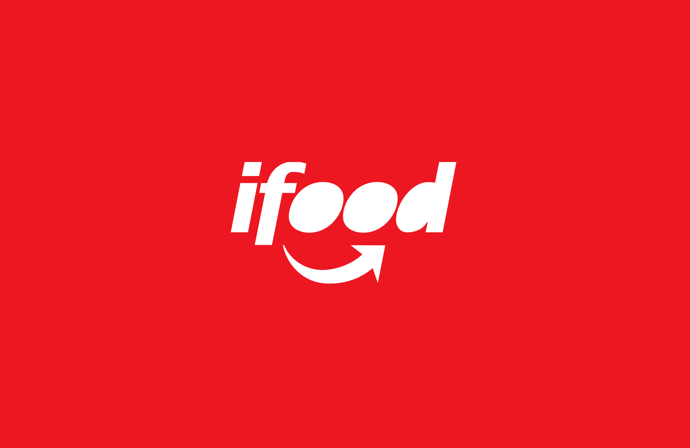

# iFood!

```{css, echo = FALSE}
body {
    font-family: 'Helvetica';
}

h1, h2, h3 {
    font-family: 'Montserrat';
    color: #EA1D2C;
}

a {
    color: #EA1D2C;
}

a:focus, a:hover {
    color: #EA1D2C;
    text-decoration: underline;
}

img {
    width: 100%;
}

.list-group-item.active, .list-group-item.active:focus, .list-group-item.active:hover {
    z-index: 2;
    color: white;
    background-color: #EA1D2C;
    border-color: #337ab7;
}
```

Esta análise é uma continuação de um processo que envolveu a coleta de dados via Web Scraping[^1] e junção de outros conjuntos de dados coletados do [site do iFood](https://www.ifood.com.br/).    
Você pode ver todo o processo no [meu repositório](https://github.com/KenzoBH/Web-Scraping-and-EDA-iFood) no GitHub.  
- [Bruno Kenzo](https://kenzobh.github.io/).

[^1]: Web Scraping, ou "Raspagem da Web", é o processo de coletar dados de sites da internet. Utilizei bibliotecas específicas para esse processo - Selenium - em linguagem Python e conhecimentos de HTML.

# Introdução

Nessa análise exploratória de dados, irei explorar os dados coletados de `r nrow(read.csv('final-ifood-data.csv'))` restaurantes e alguns aspectos relacionados a eles na plataforma online da iFood.



## Importando pacotes e dados

Os dados utilizados estão disponíveis no repositório já citado anteriormente, em formato `.csv`.

```{R Importando pacotes, warning = FALSE, message = FALSE}
library(tidyverse)  # Biblioteca para manipulação e visualização de dados
library(knitr)      # Melhor visualização de tabelas em Rmd e HTML
library(kableExtra) # Edição estética de tabelas
```

Vou renomear algumas colunas para melhor interpretabilidade.  
Esse é o nosso conjunto de dados:

```{R Importando os dados, message = FALSE}

df <- read_csv('final-ifood-data.csv') # Importação dos dados em .csv
df <- rename(df, Restaurante = `Título`, Taxa = `Preço`, Coletor = Dono)
# Renomeção de colunas para melhor interpretação

df %>%
    kable() %>%  # Melhor visualização
    kable_styling(full_width = FALSE, # Estéticas
                  bootstrap_options = c('striped', 'hover', 'responsive')) %>% 
    scroll_box(width = '100%', height = '500px')
```

Nosso dataframe possui `r nrow(df)` linhas e `r ncol(df)` colunas, as quais representam:

- **Restaurante**: nome do restaurante
- **Nota**: média das notas fornecidas pelos usuários no site sobre o restaurante, de 0 a 5
- **Tipo**: tipo de comida que é vendida pelo restaurante
- **Tempo**: tempo médio de entrega (em minutos) até a localização daquele que coletou o dado
- **Taxa**: taxa fixa do frete, em R$
- **Coletor**: aquele que coletou o dado

Sobre as principais medidas estatísticas de cada coluna:

```{R, Estatísticas básicas}
options(knitr.kable.NA = '')

df %>% 
    summary() %>% # Principais medidas estatísticas
    kable() %>% 
    kable_styling(full_width = FALSE,
                  bootstrap_options = c('striped', 'hover', 'responsive'))
```

Percebe-se que há restaurantes com nota 0. São novos restaurantes na plataforma - informação que foi obtida na coleta de dados. Irei omitir análises relacionadas com a coluna `Tempo`, uma vez que ela é relativa à localização de cada pessoa que coletou os dados.

Vamos para a análise!

# Notas dos Restaurantes

Primeiramente, veremos quais são os restaurantes com nota máxima.

```{R Melhores restaurantes, fig.align = 'center'}
melhores_restaurantes <- df %>% 
    filter(Nota == 5) %>% # Apenas com nota 5
    select(Restaurante) %>% # Apenas a coluna 'Título'
    c() # Juntar em um vetor

annotation = str_c(melhores_restaurantes[[1]][1], ' e ', melhores_restaurantes[[1]][2]) # Já tinha visto que haviam apenas 2 restaurante com nota 5
print(annotation)
```

Vamos ver mais informações sobre esses dois restaurantes.

```{R Sobre os melhores restaurantes}
df %>% 
    filter(Nota == 5) %>% 
    kable(caption = "Melhores restaurantes") %>% 
    kable_styling(full_width = FALSE,
                  bootstrap_options = c('striped', 'hover', 'responsive'))
```

Nota-se que um deles - *Jakes Food* - tem frete grátis. Será que os usuários levam o preço da taxa de entrega em conta na hora da avaliação? Veremos isso mais pra frente.   
Vamos ver a distribuição das notas não nulas.

```{R Distribuição das notas}
red <- '#EA1D2C'
black <- '#3F3E3E'
grey <- '#F2F2F2'

my_theme <- theme(plot.title = element_text(color = black, size = 25, face = 'bold',),
                  plot.subtitle = element_text(color = black),
                  axis.title.x = element_text(color = red, face = 'bold'),
                  axis.title.y = element_text(color = black),
                  panel.background = element_rect(fill = grey),
                  axis.line = element_line(colour = black),
                  legend.position = 'none')

df %>% 
    filter(Nota > 0) %>% # Apenas notas não nulas
    ggplot(aes(x = Nota)) +
    geom_bar(fill = red, color = black) + # Optei por um gráfico de barras
    geom_segment(aes(x = 5, y = 1.5, xend = 5, # Adiciona uma linha vertical
                     yend = 19, color = black)) +
    annotate('text', label = annotation, x = 5, y = 20.5, # Adiciona um texto
             hjust = 'right', fontface = 'bold', color = black) +
    annotate('text', x = 5, y = 19.5,hjust = 'right', color = black, size = 3,
             label = 'Únicos Restaurantes com nota 5 são do Emerson e do Marco') +
    labs(title = 'Distribuição das Notas\ndos Restaurantes',          # Definição do título,
         subtitle = 'Consideradas apenas notas não-nulas no gráfico', # do subtítulo,
         x = 'Nota', y = 'Frequência') +                              # e dos eixos
    my_theme
```

Nota-se que é uma distribuição assimétrica à esquerda[^2]. A moda da distribuição é a nota 4,5.[^3] Ademais, há um restaurante com uma nota abaixo da maioria dos outros, é um ponto isolado do gráfico, com uma nota abaixo de 3,5. Vamos ver qual é esse restaurante, e ver os com nota 0 também.

[^2]: Uma distribuição assimétrica à esquerda é aquela em que os dados so concentram em um valor acima da média amostral, formando um histograma semelhante a uma subida de colina da esquerda para a direita.

[^3]: A moda de uma distribuição é o valor mais frequente da mesma. Há distribuições que podem ter mais de uma moda - distribuições bimodais, trimodais, etc.

```{R Sobre notas baixas}
df %>% 
    filter(Nota < 3.5) %>% # Filtrar as notas menores que 3,5
    mutate(
        Nota = cell_spec(Nota, "html", color = ifelse(Nota > 0, red, black))
    ) %>% # Colorir as notas maiores que 0 (apenas uma)
    arrange(desc(Nota)) %>%  # Ordenar pelas notas de forma decrescente
    kable("html", escape = F, caption = 'Restaurantes com notas menores que 3,5') %>% 
    kable_styling(full_width = FALSE,
                  bootstrap_options = c('striped', 'hover', 'responsive'))
```

# Sobre as Taxas

Vamos ver a distribuição das taxas

```{R Distribuição das taxas}
df %>% # Optei por um histograma, pois é uma variável contínua
    ggplot(aes(x = Taxa, fill = (Taxa == 0 | Taxa > 20))) +
    geom_histogram(bins = 10) +
    scale_fill_manual(values = c(black, red)) +
    geom_segment(aes(x = 22, y = 0.5, xend = 22, # Adiciona uma linha vertical
                     yend = 14.5, color = black)) +
    annotate('text', label = '20%', x = 0, y = 13, # Adiciona um texto
             hjust = 'center', fontface = 'bold', size = 4, color = grey) +
    annotate('text', label = "Lima's Lanches", x = 22, y = 17, # Adiciona um texto
             hjust = 'right', fontface = 'bold', color = black) +
    annotate('text', label = 'Será que a alta taxa afeta a avaliação dos usuários?',
             x = 22, y = 15.5, hjust = 'right', color = black, size = 2.5) +
    labs(title = 'Distribuição das Taxas\ndos Restaurantes', # Definição do título,
         subtitle = 'Cerca de 20% dos restaurantes optam por não cobrar taxas de entrega',
         x = 'Taxas', y = 'Frequência') +                    # e dos eixos
    my_theme +
    theme(plot.subtitle = element_text(color = red))  # Subtítulo em vermelho
```

Dessa distribuição, nota-se diversas peculiaridades. Muitos restaurantes não cobram taxa de entrega. De forma mais específica, `r nrow(filter(df, Taxa == 0))` restaurantes.  
Ademais, são poucos aqueles que cobram menos que R$5,00 - talvez não valha a pena cobrar uma taxa pequena, pois pode ser mais estratégico não cobrar taxa alguma e mostar-se mais atraente a possíveis clientes.

Sobre o ponto isolado com taxa de R$22,00: o restaurante é Lima's Lanches, sua nota é `r select(filter(df, Taxa > 20), Nota)`. Talvez, a taxa não influencie tanto na avaliação dos clientes, e sim o sabor da comida. Ou, talvez, os lanches do Lima's Lanches valham à pena a alta taxa. Veremos:

```{R Sobre influência da taxa na nota, message = FALSE}
df %>% 
    mutate(Taxa = ifelse(Taxa <= 5, 'Barata', 'Cara')) %>% 
    group_by(Taxa) %>% 
    summarise('Média das Notas' = mean(Nota)) %>% 
    kable(caption = 'Sobre a influência da taxa nas notas dos restaurantes') %>% 
    kable_styling(full_width = FALSE,
                  bootstrap_options = c('striped', 'hover', 'responsive'))
```

Considerei baratas aquelas taxas que são menores ou iguais a R$5,00, e caras as que não. Ao que indica, os restaurantes que cobram altas taxas são restaurantes mais bem-avaliados - talvez por entregarem uma comida de mais alto nível.  
Vejamos a distribuição das taxas em função das notas:

```{R Taxas vs. Notas}
df %>% 
    ggplot(aes(y = Taxa, x = Nota, color = (Taxa <= 5 & Nota >= 4))) +
    scale_color_manual(values = c(black, red)) +
    geom_point() +
    labs(title = 'Taxa vs. Nota',
         subtitle = 'Em vermelho, encontram-se restaurantes com baixa taxa e altas notas.') +
    my_theme +
    theme(plot.subtitle = element_text(color = red))
```

Esperava que os restaurantes com menor taxa seriam melhores avaliados. Porém, como visto no gráfico de dispersão acima, não parece ter uma relação entre a taxa e a nota do restaurante.  
Há `r sum(df$Taxa == 0)` restaurantes que não cobram taxa dentre os `r dim(df)[1]`.

Parece, portanto, que a taxa de frete não impacta a avaliação do restaurante.

# Dos Tipos {.tabset}

Vejamos a distribuição dos restaurantes agrupados por tipo de comida:

## Desconsiderando notas 0
```{R Sumário por tipos de restaurantes, message = FALSE}
df %>% 
    filter(Nota > 0) %>% 
    group_by(Tipo) %>% 
    summarise(Quantidade = n(), `Taxa Média` = mean(Taxa),
              `Nota Média` = mean(Nota)) %>% 
    arrange(desc(`Nota Média`)) %>% 
    kable(caption = 'Restaurantes agrupados por tipo', 'html') %>% 
    kable_styling(full_width = FALSE,
                  bootstrap_options = c('striped', 'hover', 'responsive')) %>% 
    scroll_box(width = '55%', height = '300px',
               extra_css = 'margin-left: 50%; transform: translateX(-50%); ')
```

Comidas coreanas se destacam dentre os tipos de comida - porém, se referem a apenas 2 restaurantes: `r select(filter(df, Tipo == 'Coreana'), Restaurante)[[1]]`. Destaque para Doces & Bolos, que possuem uma alta nota média com 9 restaurantes.

## Considerando notas 0
```{R Sumário por tipos de restaurantes considerando 0, message = FALSE}
df %>% 
    group_by(Tipo) %>% 
    summarise(Quantidade = n(), `Taxa Média` = mean(Taxa),
              `Nota Média` = mean(Nota)) %>% 
    arrange(desc(`Nota Média`)) %>% 
    kable(caption = 'Restaurantes agrupados por tipo') %>% 
    kable_styling(full_width = FALSE,
                  bootstrap_options = c('striped', 'hover', 'responsive')) %>% 
    scroll_box(width = '55%', height = '300px',
               extra_css = 'margin-left: 50%; transform: translateX(-50%); ')
```


Comidas coreanas se destacam dentre os tipos de comida - porém, se referem a apenas 2 restaurantes: `r select(filter(df, Tipo == 'Coreana'), Restaurante)[[1]]`. Destaque para Doces & Bolos, que possuem uma alta nota média com 9 restaurantes, e comida Brasileira, que possui 11 restaurantes com nota média de 3,27.

# Conclusão

Nota-se, portanto, que dos 118 estabelecimentos analisados, a maioria possui uma alta avaliação no site da plataforma. Porém, encontram-se alguns pontos isolados com notas abaixo do esperado - Jama Masjid com nota 3,2 e outros 11 restaurantes com nota 0, pois são novos no iFood.

Os 2 melhores restaurantes dentro os coletados são Cacau Show - Carrefour Jacu Pessêgo e Jakes Food, com nota 5 - seria interessante coletar a quantidade de avaliações dos mesmos.

Ademais, notou-se também que muitos restaurantes optam por não cobrar taxas de frete, o que não pareceu impactar na avaliação dos usuários. E destaque para os restaurantes de comida coreana, que obtiveram a maior média das avaliações no iFood (porém, com apenas 2 restaurantes).

## Contato

Veja todo o processo desse projeto [neste repositório](https://github.com/KenzoBH/Web-Scraping-and-EDA-iFood).  
Para entrar em contato comigo, use qualquer um desses meios:

[Website](https://kenzobh.github.io/)   
Email: [brunokenzoh@usp.br](mailto:brunokenzoh@usp.br)  
LinkedIn/[bruno-kenzo](https://www.linkedin.com/in/bruno-kenzo/)  
GitHub/[KenzoBH](https://github.com/KenzoBH)

Obrigado pela leitura! :D  
- *Kenzo.*
